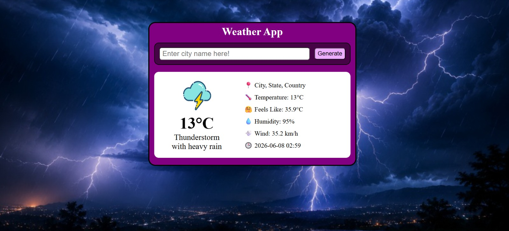

# 🌦️ Weather App

A modern and responsive Weather App built using HTML, CSS, and JavaScript. The application fetches real-time weather information using the WeatherAPI and displays detailed weather conditions for any city around the world.

## 🚀 Live Demo

https://gandhigarvit01.github.io/Weather-App/

## 📸 Preview



## ✨ Features

* 🔍 Search weather by city name
* 🌡️ Real-time temperature
* 🤗 Feels like temperature
* 💧 Humidity information
* 💨 Wind speed
* 📍 City, state and country details
* 🕒 Local time display
* 🌤️ Dynamic weather icons
* ⚠️ Invalid city error handling
* 📱 Responsive UI design

## 🛠️ Built With

* HTML5
* CSS3
* JavaScript (ES6)
* WeatherAPI

## 📂 Project Structure

```text
Weather-App/
│
├── index.html
├── style.css
├── app.js
├── preview.jpeg
└── README.md
```

## ⚙️ Getting Started

1. Clone the repository

```bash
git clone <repository-url>
```

2. Open the project folder

3. Run `index.html` in your browser

## 🌍 Weather Information Displayed

* Temperature
* Feels Like Temperature
* Weather Condition
* Humidity
* Wind Speed
* Local Time
* Location Information

## 🎯 Future Improvements

* 5-Day Forecast
* Dark/Light Mode Toggle
* Current Location Weather
* Hourly Forecast
* Weather Background Animations

---

Made with ❤️ using HTML, CSS and JavaScript.
